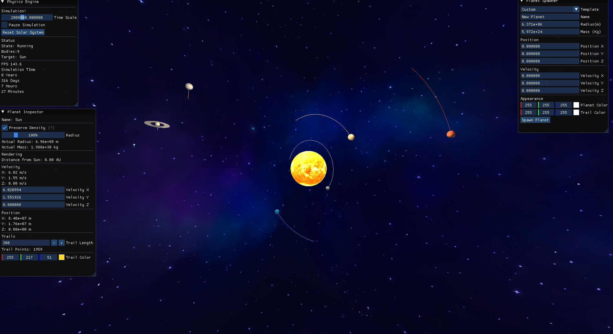
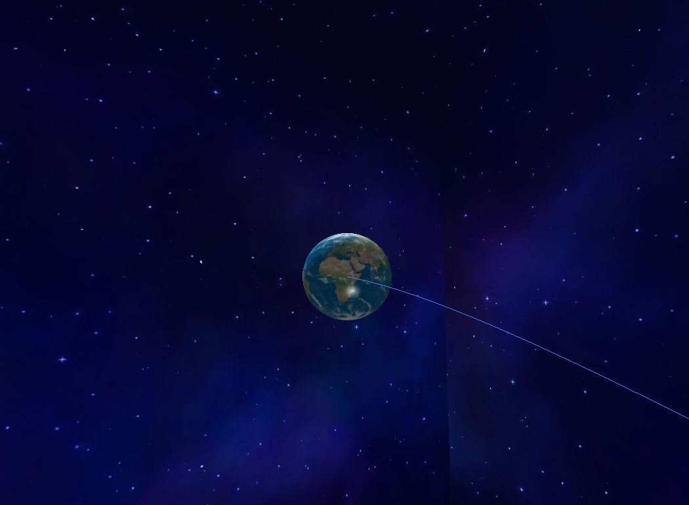
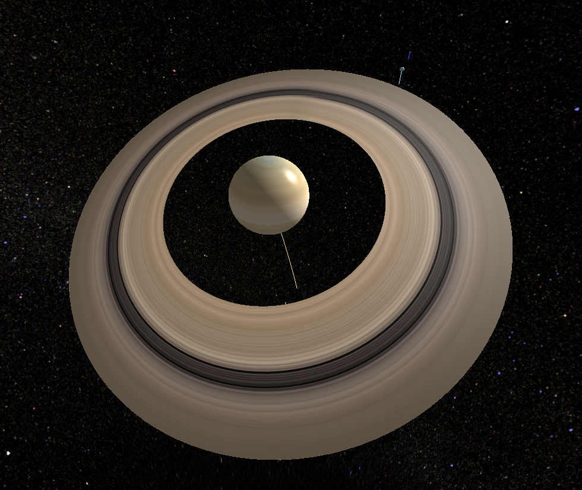
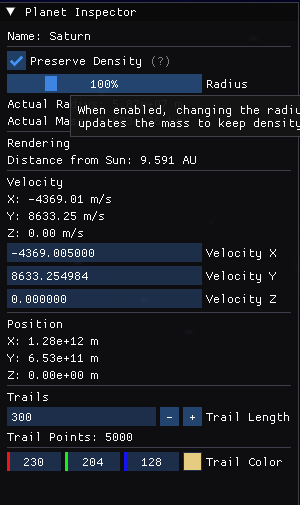
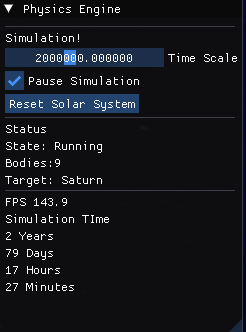
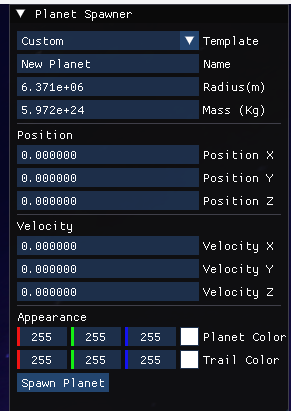

# 3D Physics Engine

A real-time **3D Newtonian gravity simulator and physics sandbox** built completely from scratch in **C++** using **OpenGL**.

This project focuses on learning engine architecture, rendering, mathematics, and physics rather than relying on existing game engines or physics libraries.

---

# Features

## Rendering

- Real-time 3D rendering using OpenGL
- Textured planets
- Skybox rendering
- Dynamic camera system
- Saturn ring rendering
- Planet trail rendering
- Adjustable trail length
- Custom trail colors
- Runtime planet colors

---

## Physics

- Newtonian gravitational simulation
- N-body gravity
- Semi-implicit Euler integration
- Time scaling
- Pause / Resume simulation
- Solar system reset
- Runtime planet spawning
- Orbit visualization

---

## Sandbox

Interactive ImGui interface including:

- Simulation controls
- Planet inspector
- Planet spawner
- Camera target switching
- Planet radius editing
- Automatic mass preservation when resizing planets
- Velocity editing
- Position editing
- Trail customization
- Planet color picker
- Trail color picker

---

# Controls

| Key | Action |
|------|--------|
| W A S D | Move Camera |
| Mouse | Rotate Camera |
| Mouse Wheel | Zoom |
| TAB | Cycle Target Planet |

---

# Screenshots

## Solar System Overview

<p align="center">

</p>

---

## Earth

<p align="center">

</p>

---

## Saturn Rings

<p align="center">

</p>

---

## Planet Inspector

<p align="center">

</p>

---

## Simulation Controls

<p align="center">

</p>

---

## Planet Spawner

<p align="center">

</p>

---

# Project Structure

```
Physics Engine
│
├── Rendering
│   ├── Mesh
│   ├── Texture
│   ├── Shader
│   ├── Camera
│   ├── Skybox
│   ├── TrailRenderer
│   └── PrimitiveMeshFactory
│
├── Physics
│   ├── Universe
│   ├── CelestialBody
│   ├── Gravity
│   ├── Transform
│   └── Integration
│
├── Sandbox
│   ├── Planet Inspector
│   ├── Planet Spawner
│   ├── Simulation Window
│   └── Camera Controls
│
└── Assets
    ├── Planet Textures
    ├── Skybox
    └── Saturn Ring Texture
```

---

# Technologies

- C++
- OpenGL 3.3
- GLFW
- GLEW
- GLM
- Dear ImGui
- stb_image

---

# Current Progress

- ✅ Modular rendering architecture
- ✅ Newtonian gravity simulation
- ✅ Solar system generation
- ✅ Camera system
- ✅ Planet textures
- ✅ Skybox
- ✅ Saturn rings
- ✅ Trail rendering
- ✅ Planet spawning
- ✅ Runtime editing
- ✅ Planet & trail color customization
- ✅ Reset simulation

---

# Planned Features

## Physics

- Collision detection
- Collision response
- Rigid body dynamics
- Barnes-Hut gravity optimization
- Better numerical integrators (RK4 / Verlet)
- Multithreaded simulation

## Rendering

- Proper transparent Saturn rings
- Shadow mapping
- Bloom
- HDR rendering
- Atmospheres
- Planetary clouds
- Better skybox
- Asteroid belts

## Sandbox

- Save / Load simulations
- Camera bookmarks
- Simulation recording
- Object deletion
- Gizmos
- Statistics window

---

# Goal

The long-term goal of this project is to build a complete 3D physics engine capable of simulating realistic planetary systems, orbital mechanics, and eventually more advanced physics such as rigid body dynamics, collisions, and large-scale astrophysical simulations.
