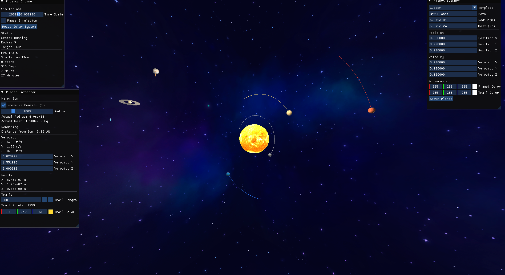
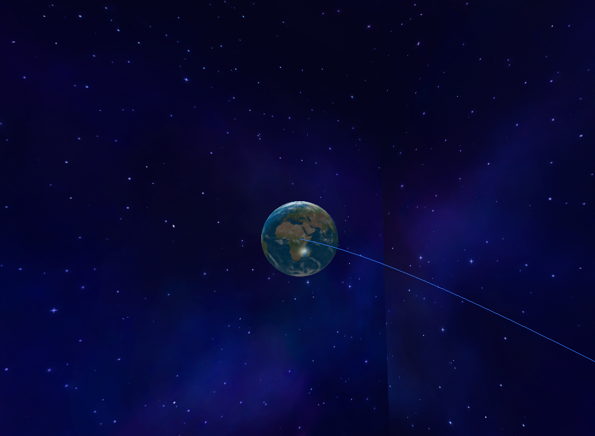
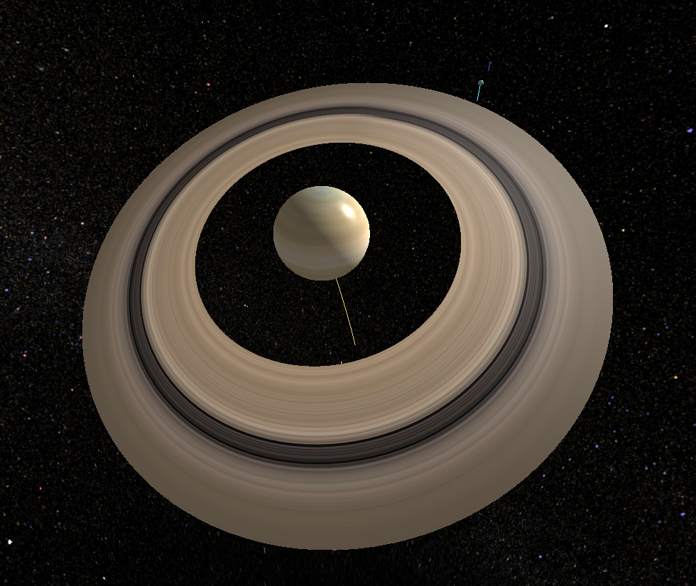
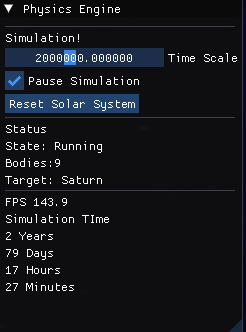
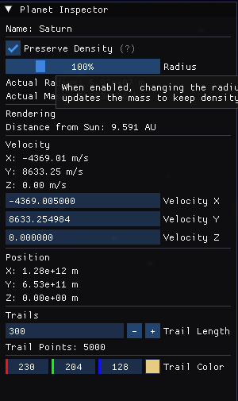
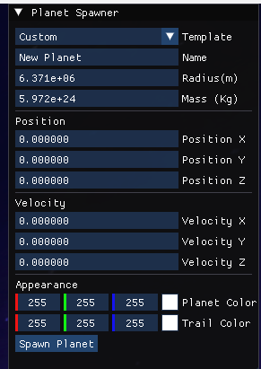

# Physics Engine — 3D Solar System Simulator
 
A 3D solar system sim built from scratch in C++ and OpenGL.
 
Everything uses real SI units for the physics, and gravity is full n-body, meaning every planet actually pulls on every other planet. The spheres themselves are procedurally generated too, drawn by looping vertices along latitude and longitude lines.
 
## Demo
 
[watch a short demo here](https://www.youtube.com/watch?v=hP4zgpyufLg)
 

 
## Installation
 
**Option 1 — just install from the releases**
 
1. Install the newest release from [Releases page](https://github.com/shadowplayzman/physics-engine/releases)
2. Unzip the downloaded folder.
3. Run `physics-engine.exe`
4.If you see an error saying `VCRUNTIME140.dll` is missing run `vc_redist.x86.exe` from the zip file to install the Microsoft Visual C++ Redistributable
 
The current release is built for Windows x86 and requires an OpenGL 3.3 compatible system.
 
**Option 2 — build it yourself from source**
 
1. Clone the repo
```
   git clone https://github.com/shadowplayzman/physics-engine.git
```
2. Open `physics-engine.slnx` in Visual Studio (2022 or newer)
3. All required libraries (GLFW, GLEW, GLM, Dear ImGui, stb_image) are already in the `folder
4. Set the build config to `Release` and `X86`
5. Compile and run the program
 
## Features
 
- Real-time newtonian gravity, full n-body (every body affects every other body)
- Procedurally generated spheres (no premade meshes)
- Textured planets, saturn rings, skybox


 
- Orbit trails with adjustable length and color
- Pause/resume and adjustable simulation speed
- Spawn custom planets or ones based on real planet templates
- Edit any planet's mass, radius, position, velocity, trail length and color live, mid-simulation
- Standalone executable, no install needed
## The UI
 
The whole interface is built with dear imgui, split into 3 windows:
 
**Simulation window** — Shows how many bodies are currently in the scene, how much time has passed (in earth years/days/hours), lets you scale simulation speed up or down, pause it, or reset back to the default solar system.
 

 
**Planet Inspector** — Press TAB to cycle through planets (defaults to the sun). shows and lets you edit mass, radius, position, velocity, trail length and trail color for whichever planet is selected. there's also a "preserve density" toggle — turn it on and increasing radius scales mass along with it automatically, turn it off and you can change mass/radius independently.
 

 
**Planet Spawner** — Spawn new bodies based on templates of the real planets (tweak values if you want), or go full custom and build a body from scratch, then hit spawn.
 

 
## Controls
 
- Left Mouse Button — rotate camera
- Mouse Wheel — zoom
- TAB — switch between planets
Most of the actual simulation control happens through the imgui windows, not keybinds.
 
## Built with
 
- C++
- OpenGL
- GLFW
- GLEW
- GLM
- Dear ImGui
- stb_image
## Known issues
 
- Built for 1920x1080, hasn't been adapted for other resolutions/window sizes yet, so UI scaling might look off elsewhere,will try to fix in the next release
- The current release is built for Windows x86
## Why I built this
 
Mainly wanted to learn C++ libraries ike opengl,dearImgui. Learning the OpenGL side (matrices, model matrices, translation matrices, all of it) was probably the hardest part of the whole project. this is v1, planning to keep building on it in the future.

#Future Plans 
I have decided to make different types of sandboxes on top of existing solar system sim. For example gravity sim, Projectile motion sim you can select the planet then the select the sandbox and see how gravity or the projectile motion will work on that planet 
